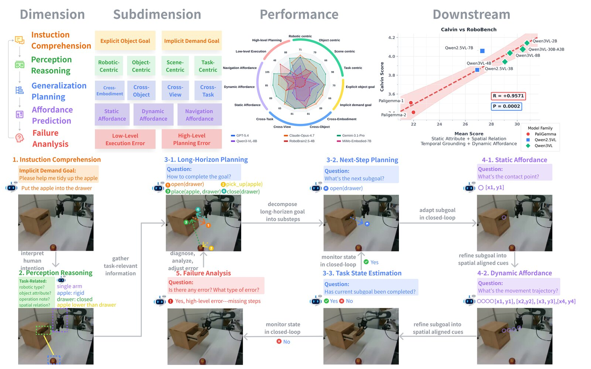

<h1 align="center">🤖 RoboBench</h1>

<p align="center">
  <strong>A comprehensive evaluation benchmark for Multimodal Large Language Models as embodied robot brains.</strong>
</p>

<p align="center">
  <a href="https://arxiv.org/abs/2510.17801"></a>
  <a href="https://robo-bench.github.io/"></a>
  <a href="https://huggingface.co/datasets/LeoFan01/RoboBench"></a>
  <a href="https://huggingface.co/datasets/lyl010221-pku/RoboBench-Results"></a>
  <a href="https://github.com/yulin-luo/RoboBench/blob/main/LICENSE"></a>
  
  
</p>

---

## 📌 Featured Resources

- 📄 **Paper**: [RoboBench: A Comprehensive Evaluation Benchmark for Multimodal Large Language Models as Embodied Brain](https://arxiv.org/abs/2510.17801)
- 🌐 **Project website**: [robo-bench.github.io](https://robo-bench.github.io/)
- 🤗 **Dataset**: [LeoFan01/RoboBench](https://huggingface.co/datasets/LeoFan01/RoboBench)
- 📊 **Official results**: [lyl010221-pku/RoboBench-Results](https://huggingface.co/datasets/lyl010221-pku/RoboBench-Results)
- 💬 **Prompts and pipeline**: [docs/PROMPTS_AND_PIPELINE.md](docs/PROMPTS_AND_PIPELINE.md)
- 💻 **Code**: [github.com/yulin-luo/RoboBench](https://github.com/yulin-luo/RoboBench)

> Accepted to **ECCV 2026**.

## 📰 News

- 📊 **2026.07** - Congratulations to [HY-Embodied](https://github.com/Tencent-Hunyuan/HY-Embodied)! **HY-Embodied-0.5 MoT-2B** and **Hy-Embodied-VLM-1.0 A3B** include **RoboBench-MCQ** and **RoboBench-Planning** as part of their official evaluation suite, highlighting RoboBench as a recognized benchmark for embodied foundation models.
- 🎉 **2026.07** - RoboBench is accepted to **ECCV 2026**. The official release reports results for **18 state-of-the-art MLLMs** with the MLLM-as-world-simulator planning framework.
- 📰 **2026.07** - RoboBench is featured by [具身智能之心](https://mp.weixin.qq.com/s/SdGEqu_1mz14DhUumTZ3FQ), introducing our benchmark for evaluating MLLMs as embodied brains.

## 🔍 Overview

RoboBench evaluates MLLMs on robotic manipulation tasks by decomposing embodied intelligence into diagnostic abilities rather than reporting only end-to-end task success. It covers the full execution pipeline from instruction comprehension and perception to generalized planning, affordance reasoning, and failure analysis. The ECCV 2026 release contains **5 dimensions, 14 capability groups, 25 tasks, 6,092 QA pairs, and results for 18 state-of-the-art MLLMs**.

<p align="center">
  
</p>

### ✨ What RoboBench Provides

- **Fine-grained embodied evaluation**: 5 cognitive dimensions, 14 capability groups, 25 tasks, and 6,092 QA pairs for diagnosing where MLLMs succeed or fail as robot brains.
- **18-model leaderboard**: closed-source, open-source, and embodied MLLMs are evaluated in the official results release, plus a GPT-5.4 text-only ablation for visual-grounding analysis.
- **Cross-domain planning tests**: Robot morphology, object type, viewpoint, attributes, and world-knowledge generalization.
- **MLLM-as-world-simulator evaluation**: Planning outputs are judged with a simulator-style MLLM evaluator for physically grounded task completion.
- **Reproducible package**: YAML-driven configuration, API inference, task-specific evaluators, checkpoint/resume, and multi-run aggregation.
- **Reusable prompt pipeline**: Open prompt construction utilities for robotic video and image-based question answering, with prompt coverage documented in [docs/PROMPTS_AND_PIPELINE.md](docs/PROMPTS_AND_PIPELINE.md).

## 🧭 Benchmark Dimensions

| Dimension | Representative capabilities | Evaluation type |
| --- | --- | --- |
| **Instruction Comprehension** | Explicit goals, implicit demands, cross-task navigation | Planning |
| **Perception and Reasoning** | Object attributes, spatial relations, temporal causality, robot type/view | Multi-choice |
| **Generalized Planning** | Cross-embodiment, cross-object, cross-view, cross-attribute, world knowledge | Planning Q1/Q2/Q3 |
| **Affordance Reasoning** | Static affordance, dynamic affordance, navigation visual prompts | Point / coordinate |
| **Error Analysis** | High-level planning errors, low-level execution errors | Multi-choice |

## ⚙️ Installation

```bash
git clone https://github.com/yulin-luo/RoboBench.git
cd RoboBench

# Core package for API-based inference and evaluation.
pip install -e .

# Optional dependencies for local HuggingFace vision-language models.
pip install -e ".[local]"
```

### 📦 Requirements

- Python >= 3.10
- API-compatible endpoint supported by the OpenAI Python client
- OpenCV, PyYAML, Pydantic, NumPy, tqdm
- Optional local-model stack: torch, transformers, pillow

## 📚 Dataset

Download the released RoboBench dataset from Hugging Face and point the config to the local copy.

```bash
huggingface-cli download \
  --repo-type dataset LeoFan01/RoboBench \
  --local-dir data/RoboBench-hf
```

The pipeline uses prompt-ready question JSONL files from `paths.middle_file_dir` and uses `paths.data_root` to resolve images and released `questions.json` metadata. If your dataset package stores these JSONL files outside `data/RoboBench-hf`, keep that directory as a sibling `data/middle_file`.

Official score tables and model-output JSON files are hosted separately to keep this repository lightweight:

- [lyl010221-pku/RoboBench-Results](https://huggingface.co/datasets/lyl010221-pku/RoboBench-Results)

The official leaderboard reports 18 evaluated MLLMs:

```text
GPT-5.4, GPT-5.2, GPT-5, GPT-4.1, GPT-4o,
Claude-Opus-4.7, Claude-Sonnet-4.6, Claude-Sonnet-4.5, Claude-Haiku-4.5,
Gemini-3.1-Pro, Gemini-2.5-Pro, Gemini-2.5-Flash,
Qwen3-VL-8B, Qwen2.5-VL-7B-Instruct, LLaVA-OneVision-7B,
RoboBrain-2.0-7B, RoboBrain-2.5-4B, MiMo-Embodied-7B
```

## 🚀 Quick Start

### 1. 🛠️ Prepare a Config

```bash
cp config/benchmark.example.yaml config/benchmark.yaml

export DUBRIFY_API_KEY="your-api-key"
export ROBOBENCH_API_BASE_URL="https://your-endpoint/v1"
export ROBOBENCH_DATA_ROOT="$PWD/data/RoboBench-hf"
export ROBOBENCH_MIDDLE_FILE_DIR="$PWD/data/middle_file"
export ROBOBENCH_RESULTS_ROOT="$PWD/results"
export ROBOBENCH_CACHE_DIR="$PWD/cache"
export ROBOBENCH_OLD_IMAGE_PREFIX=""
```

Edit `config/benchmark.yaml` to choose models, dimensions, and concurrency settings. Keep `config/benchmark.yaml` local; it is intentionally ignored by git.

### 2. 🧠 Run Inference

After `pip install -e .`, the package exposes a `robobench` command-line entrypoint. The CLI uses a top-level `--config` argument before the subcommand.

```bash
robobench --config config/benchmark.yaml inference \
  --model gpt-5.4 \
  --dimension perception_reasoning \
  --subtask static_attribute \
  --max-samples 1 \
  --run-id smoke_test
```

If you prefer not to install the package, use the equivalent Python module form:

```bash
PYTHONPATH=src python -m robobench.cli --config config/benchmark.yaml inference \
  --model gpt-5.4 \
  --dimension perception_reasoning \
  --subtask static_attribute \
  --max-samples 1 \
  --run-id smoke_test
```

For text-only ablation:

```bash
robobench --config config/benchmark.yaml inference \
  --model gpt-5.4 \
  --dimension perception_reasoning \
  --subtask static_attribute \
  --max-samples 1 \
  --run-id run_0_text_only \
  --text-only
```

### 3. 📊 Evaluate Existing Results

```bash
robobench --config config/benchmark.yaml evaluate \
  --dimension perception_reasoning
```

Remove `--max-samples` when running the full selected dimension.

### 4. 🔁 Run an End-to-End Pipeline

```bash
robobench --config config/benchmark.yaml pipeline --repeats 3
```

The full pipeline runs inference, evaluation, and aggregation across repeated runs configured by `runs.num_repeats`.

## 🧩 Configuration

Most behavior is controlled from `config/benchmark.yaml`.

### 🔐 API Settings

| Field | Description |
| --- | --- |
| `api.base_url` | OpenAI-compatible API endpoint |
| `api.api_key` | API key, usually supplied as `${DUBRIFY_API_KEY}` |
| `api.max_concurrent` | Task-level concurrency setting |
| `api.api_max_concurrent` | Request-level API concurrency |
| `api.task_timeout` | Per-request timeout in seconds |
| `api.retry_attempts` | Maximum retry attempts for transient failures |

### 🧠 Model Selection

```yaml
models:
  - name: "gpt-5.4"
    provider: "openai"
    vision: true

text_only_variants:
  - name: "gpt-5.4"
    suffix: "text_only"
```

### 🧪 Dimension Selection

```yaml
dimensions:
  perception_reasoning:
    enabled: true
    eval_type: "multi_choice"
    system_prompt_key: "perception"
    subtasks:
      - static_attribute
      - spatial_relation
```

### 📁 Paths

| Field | Description |
| --- | --- |
| `paths.data_root` | Local RoboBench dataset directory |
| `paths.middle_file_dir` | Directory containing question JSONL files |
| `paths.results_root` | Model outputs and evaluated scores |
| `paths.cache_dir` | Checkpoints and temporary files |
| `paths.old_prefix` / `paths.new_prefix` | Image-path prefix rewrite for released dataset paths |

## 🗂️ Project Structure

```text
RoboBench/
├── config/
│   └── benchmark.example.yaml
├── src/robobench/
│   ├── analysis/          # Dataset and correlation analysis utilities
│   ├── data/              # Dataset loading from question JSONL files
│   ├── evaluation/        # Multi-choice, planning, point, IoU, trajectory evaluators
│   ├── generation/        # Generation-stage nodes
│   ├── inference/         # Async API client, checkpoints, image handling, local HF client
│   ├── pipeline/          # Dataflow nodes and executor
│   ├── prompts/           # Prompt builders and robot-task templates
│   ├── scoring/           # Multi-run aggregation and statistics
│   └── utils/             # Path utilities
├── pyproject.toml
└── README.md
```

## 📏 Evaluation Metrics

| Evaluator | What it checks |
| --- | --- |
| `multi_choice` | Multiple-choice, yes/no, and open-ended response normalization/scoring |
| `planning` | Q1 multi-step plans, Q2 single-step actions, Q3 state estimation |
| `point` | Distance between predicted and ground-truth coordinates |
| `iou` | Bounding-box intersection over union |
| `trajectory` | Multi-point trajectory comparison |

Planning evaluation can call an evaluator model, configured by `evaluation.planning.eval_model`, to judge action feasibility and task completion.

## 💬 Prompt Builder Example

```python
from robobench.prompts.builder import PromptBuilder

builder = PromptBuilder(
    data_root="data/RoboBench-hf",
    system_prompt_key="skill_list",
    old_prefix="",
    new_prefix="data/RoboBench-hf",
)

questions = [
    {
        "request_id": "example-0",
        "question": "What action should the robot take next?",
        "image_urls": ["data/RoboBench-hf/example.jpg"],
    }
]

prompts = builder.build(questions, mode="base64")
builder.save(prompts, "prompts.jsonl")
```

## 🛠️ Development

```bash
pip install -e ".[dev]"
python -m compileall -q src
black src/
ruff check src/
```

## 📝 Citation

If you use RoboBench in your research, please cite:

```bibtex
@article{luo2025robobench,
  title={RoboBench: A Comprehensive Evaluation Benchmark for Multimodal Large Language Models as Embodied Brain},
  author={Luo, Yulin and Fan, Chun-Kai and Dong, Menghang and Shi, Jiayu and Mi, Xiangju and Zhao, Mengdi and Zhang, Bo-Wen and Chi, Cheng and Liu, Jiaming and Dai, Gaole and Zhang, Rongyu and An, Ruichuan and Wu, Kun and Che, Zhengping and Xie, Shaoxuan and Yao, Guocai and Zhao, Zhongxia and Wang, Pengwei and Liu, Guang and Wang, Zhongyuan and Huang, Tiejun and Zhang, Shanghang},
  journal={arXiv preprint arXiv:2510.17801},
  year={2025}
}
```

## 📜 License

This repository is released under the [MIT License](LICENSE).
